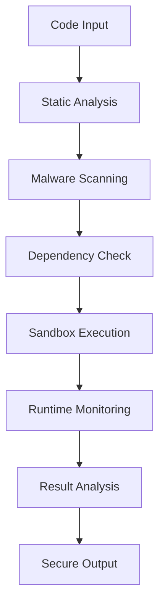

# Security Architecture & Best Practices

## 🔒 Security Overview

The Claude Code Integration & Validation Engine implements enterprise-grade security measures to ensure safe execution of untrusted code while maintaining system integrity and protecting sensitive data.

## 🏗️ Security Architecture

### Container Isolation

#### Multi-Runtime Support
- **gVisor**: User-space kernel for enhanced isolation
- **Kata Containers**: Hardware-virtualized containers
- **Docker**: Standard containerization with security hardening
- **Podman**: Rootless container execution

#### Security Controls
```yaml
security_controls:
  user: "nobody:nogroup"
  read_only: true
  network_mode: "none"
  no_new_privileges: true
  capabilities:
    drop: ["ALL"]
    add: ["CHOWN", "DAC_OVERRIDE", "FOWNER", "SETGID", "SETUID"]
  seccomp: "custom-profile"
  apparmor: "docker-default"
```

#### Resource Limits
```yaml
resource_limits:
  memory: "1024MB"
  cpu: "2.0 cores"
  disk: "1024MB"
  processes: 100
  open_files: 1024
  execution_time: "300 seconds"
```

### Network Security

#### Isolation Strategies
- **Complete Network Isolation**: No network access by default
- **Allowlist-based Access**: Specific endpoints only when required
- **Traffic Monitoring**: All network activity logged and analyzed
- **Rate Limiting**: API and network request throttling

#### Firewall Rules
```bash
# Default deny all
iptables -P INPUT DROP
iptables -P FORWARD DROP
iptables -P OUTPUT DROP

# Allow specific services
iptables -A INPUT -p tcp --dport 8000 -j ACCEPT  # API
iptables -A INPUT -p tcp --dport 8080 -j ACCEPT  # WebSocket
iptables -A INPUT -p tcp --dport 9090 -j ACCEPT  # Metrics
```

### Authentication & Authorization

#### Multi-Factor Authentication
- **JWT Tokens**: Stateless authentication with short expiry
- **API Keys**: Service-to-service authentication
- **OAuth 2.0**: Third-party integration authentication
- **RBAC**: Role-based access control

#### Permission Model
```yaml
roles:
  admin:
    permissions: ["*"]
  developer:
    permissions: ["validate:read", "validate:write", "results:read"]
  viewer:
    permissions: ["results:read", "metrics:read"]
  service:
    permissions: ["validate:write", "webhook:receive"]
```

### Data Protection

#### Encryption at Rest
- **Database**: AES-256 encryption for sensitive data
- **File Storage**: Encrypted volumes and backups
- **Secrets**: HashiCorp Vault or Kubernetes secrets
- **Logs**: Encrypted log storage with rotation

#### Encryption in Transit
- **TLS 1.3**: All API communications
- **mTLS**: Service-to-service communication
- **VPN**: Secure tunnels for remote access
- **Certificate Management**: Automated cert rotation

### Secure Code Execution

#### Sandboxing Layers
1. **Container Runtime**: gVisor/Kata isolation
2. **Seccomp Filters**: Syscall filtering
3. **AppArmor/SELinux**: Mandatory access control
4. **Namespace Isolation**: PID, network, mount isolation
5. **Cgroup Limits**: Resource constraints

#### Code Analysis Pipeline


## 🛡️ Security Controls

### Input Validation

#### Code Sanitization
```python
def sanitize_code_input(code: str) -> str:
    """Sanitize code input to prevent injection attacks."""
    # Remove dangerous patterns
    dangerous_patterns = [
        r'__import__\s*\(',
        r'eval\s*\(',
        r'exec\s*\(',
        r'compile\s*\(',
        r'open\s*\(',
        r'file\s*\(',
        r'input\s*\(',
        r'raw_input\s*\(',
    ]
    
    for pattern in dangerous_patterns:
        if re.search(pattern, code, re.IGNORECASE):
            raise SecurityError(f"Dangerous pattern detected: {pattern}")
    
    return code
```

#### File Upload Security
- **File Type Validation**: Strict allowlist of file types
- **Size Limits**: Maximum file size enforcement
- **Virus Scanning**: ClamAV integration
- **Content Analysis**: Deep file inspection

### Vulnerability Management

#### Dependency Scanning
```yaml
security_scanners:
  python:
    - safety
    - bandit
    - pip-audit
  javascript:
    - npm-audit
    - retire.js
    - audit-ci
  ruby:
    - bundler-audit
    - brakeman
  go:
    - gosec
    - nancy
  rust:
    - cargo-audit
    - cargo-deny
```

#### Container Scanning
- **Trivy**: Comprehensive vulnerability scanning
- **Grype**: Fast vulnerability detection
- **Docker Scout**: Docker Hub integration
- **Snyk**: Commercial vulnerability database

### Monitoring & Alerting

#### Security Events
```yaml
security_alerts:
  - name: "Privilege Escalation Attempt"
    condition: "container.capabilities.add != expected"
    severity: "critical"
  
  - name: "Unusual Network Activity"
    condition: "network.connections > 0 AND network_mode == 'none'"
    severity: "high"
  
  - name: "Resource Limit Exceeded"
    condition: "memory.usage > memory.limit * 0.9"
    severity: "medium"
  
  - name: "Failed Authentication"
    condition: "auth.failures > 5 IN 5m"
    severity: "medium"
```

#### Audit Logging
```json
{
  "timestamp": "2024-01-15T10:30:00Z",
  "event_type": "code_execution",
  "user_id": "user123",
  "session_id": "sess456",
  "container_id": "cont789",
  "action": "validate_code",
  "resource": "/api/v1/validate",
  "source_ip": "192.168.1.100",
  "user_agent": "Claude-Validation-Client/1.0",
  "result": "success",
  "duration_ms": 1250,
  "metadata": {
    "file_count": 5,
    "lines_of_code": 1500,
    "languages": ["python", "javascript"]
  }
}
```

## 🔐 Compliance & Standards

### Regulatory Compliance
- **SOC 2 Type II**: Security and availability controls
- **PCI DSS**: Payment card industry standards
- **HIPAA**: Healthcare data protection
- **GDPR**: European data protection regulation
- **ISO 27001**: Information security management

### Security Standards
- **OWASP Top 10**: Web application security
- **NIST Cybersecurity Framework**: Risk management
- **CIS Controls**: Critical security controls
- **SANS Top 25**: Software security errors

### Code Security Guidelines
```yaml
secure_coding_practices:
  input_validation:
    - "Validate all inputs at boundaries"
    - "Use allowlists over denylists"
    - "Sanitize data for output context"
  
  authentication:
    - "Implement multi-factor authentication"
    - "Use strong password policies"
    - "Secure session management"
  
  authorization:
    - "Principle of least privilege"
    - "Role-based access control"
    - "Regular permission audits"
  
  cryptography:
    - "Use industry-standard algorithms"
    - "Proper key management"
    - "Secure random number generation"
```

## 🚨 Incident Response

### Security Incident Workflow
1. **Detection**: Automated monitoring and alerting
2. **Analysis**: Threat assessment and classification
3. **Containment**: Isolate affected systems
4. **Eradication**: Remove threats and vulnerabilities
5. **Recovery**: Restore normal operations
6. **Lessons Learned**: Post-incident review

### Emergency Procedures
```bash
# Emergency shutdown
./scripts/emergency-shutdown.sh

# Isolate container
docker network disconnect validation-network <container_id>

# Revoke access tokens
./scripts/revoke-tokens.sh --user <user_id>

# Enable maintenance mode
./scripts/maintenance-mode.sh --enable
```

## 📋 Security Checklist

### Pre-Deployment Security Review
- [ ] All dependencies scanned for vulnerabilities
- [ ] Container images hardened and scanned
- [ ] Security configurations reviewed
- [ ] Access controls properly configured
- [ ] Encryption enabled for data at rest and in transit
- [ ] Monitoring and alerting configured
- [ ] Incident response procedures documented
- [ ] Security testing completed
- [ ] Compliance requirements verified
- [ ] Security documentation updated

### Regular Security Maintenance
- [ ] Weekly vulnerability scans
- [ ] Monthly security patches
- [ ] Quarterly access reviews
- [ ] Annual penetration testing
- [ ] Continuous security monitoring
- [ ] Regular backup testing
- [ ] Security awareness training
- [ ] Compliance audits

## 🔧 Security Configuration

### Environment Variables
```bash
# Security settings
ENABLE_SECURITY_SCANNING=true
SECURITY_SCAN_LEVEL=strict
CONTAINER_SECURITY_PROFILE=restricted
NETWORK_ISOLATION=true
AUDIT_LOGGING=true
ENCRYPTION_AT_REST=true
TLS_VERSION=1.3
CERTIFICATE_VALIDATION=strict
```

### Kubernetes Security Context
```yaml
securityContext:
  runAsNonRoot: true
  runAsUser: 65534
  runAsGroup: 65534
  fsGroup: 65534
  seccompProfile:
    type: RuntimeDefault
  capabilities:
    drop:
      - ALL
  allowPrivilegeEscalation: false
  readOnlyRootFilesystem: true
```

## 📞 Security Contacts

- **Security Team**: security@example.com
- **Incident Response**: incident@example.com
- **Vulnerability Reports**: security-reports@example.com
- **Emergency Hotline**: +1-555-SECURITY

## 📚 Additional Resources

- [OWASP Secure Coding Practices](https://owasp.org/www-project-secure-coding-practices-quick-reference-guide/)
- [NIST Cybersecurity Framework](https://www.nist.gov/cyberframework)
- [Container Security Best Practices](https://kubernetes.io/docs/concepts/security/)
- [Claude API Security Guidelines](https://docs.anthropic.com/claude/docs/security)

