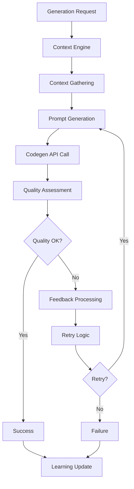

# Advanced Codegen Agent Architecture

## Overview

The Advanced Codegen Agent is a sophisticated, context-aware code generation system that leverages comprehensive codebase analysis, intelligent retry logic, and quality assessment to produce high-quality code that integrates seamlessly with existing projects.

## Architecture Components

### 1. Context Engine (`context_engine.py`)

The Context Engine is responsible for gathering comprehensive information about the codebase, team preferences, and project requirements.

#### Key Features:
- **Multi-source Context Gathering**: Analyzes codebase structure, dependencies, coding patterns, and quality metrics
- **Intelligent Caching**: Caches context data with TTL to improve performance
- **Context Compression**: Compresses large context for efficient prompt generation
- **Pattern Detection**: Identifies architectural patterns, naming conventions, and code styles
- **Quality Analysis**: Assesses code quality, test coverage, and maintainability

#### Context Types:
- **CodebaseContext**: File structure, languages, dependencies, patterns
- **TaskContext**: Current task requirements, constraints, and priorities
- **TeamContext**: Coding standards, preferred patterns, testing requirements

### 2. Advanced Codegen Client (`codegen_client.py`)

The core client that orchestrates code generation with context awareness and retry logic.

#### Key Features:
- **Context-Aware Prompting**: Generates enhanced prompts using comprehensive context
- **Intelligent Retry Logic**: Implements sophisticated retry strategies with feedback integration
- **Quality Assessment Integration**: Validates generated code against quality thresholds
- **Learning Capabilities**: Learns from successful and failed patterns
- **Multi-mode Generation**: Supports different generation modes (feature, bug fix, refactoring)

#### Generation Modes:
- `FEATURE_DEVELOPMENT`: New feature implementation
- `BUG_FIXING`: Bug identification and resolution
- `REFACTORING`: Code improvement and optimization
- `TESTING`: Test generation and enhancement
- `DOCUMENTATION`: Documentation creation and updates
- `OPTIMIZATION`: Performance and efficiency improvements

### 3. Retry Logic (`retry_logic.py`)

Sophisticated retry mechanism with multiple strategies and circuit breaking.

#### Key Features:
- **Multiple Retry Strategies**: Exponential backoff, linear backoff, fixed delay, adaptive
- **Circuit Breaker Pattern**: Prevents cascading failures
- **Reason-Specific Configuration**: Different retry behavior for different failure types
- **Jitter Support**: Adds randomness to prevent thundering herd
- **Comprehensive Statistics**: Tracks retry patterns and success rates

#### Retry Reasons:
- `QUALITY_THRESHOLD`: Generated code below quality threshold
- `API_ERROR`: Codegen API errors
- `RATE_LIMIT`: API rate limiting
- `NETWORK_ERROR`: Network connectivity issues
- `TIMEOUT`: Request timeouts
- `VALIDATION_FAILED`: Custom validation failures

### 4. Quality Assessor (`quality_assessor.py`)

Comprehensive code quality assessment engine.

#### Quality Dimensions:
- **Readability**: Code clarity, naming conventions, formatting
- **Maintainability**: Complexity, modularity, documentation
- **Correctness**: Syntax, logic, error handling
- **Performance**: Algorithm efficiency, resource usage
- **Security**: Vulnerability detection, secure coding practices
- **Documentation**: Comment coverage, API documentation
- **Testing**: Test presence and quality

#### Assessment Features:
- **Language-Specific Analysis**: Tailored assessment for different programming languages
- **Security Pattern Detection**: Identifies common security vulnerabilities
- **Performance Anti-Pattern Detection**: Finds inefficient code patterns
- **Complexity Metrics**: Calculates various complexity measures
- **Style Analysis**: Evaluates code formatting and conventions

### 5. Feedback Processor (`feedback_processor.py`)

Processes validation feedback and integrates it back into the generation process.

#### Feedback Types:
- `QUALITY_FEEDBACK`: Quality assessment results
- `ERROR_FEEDBACK`: Error messages and stack traces
- `VALIDATION_FEEDBACK`: External validation results
- `PERFORMANCE_FEEDBACK`: Performance test results
- `SECURITY_FEEDBACK`: Security scan results
- `USER_FEEDBACK`: Human reviewer feedback

#### Processing Features:
- **Pattern Recognition**: Identifies common feedback patterns
- **Improvement Suggestions**: Generates actionable improvement recommendations
- **Prompt Enhancement**: Enhances prompts with feedback for retry attempts
- **Learning Integration**: Learns from feedback to improve future generations

### 6. Prompt Templates (`prompt_templates/`)

Specialized prompt templates for different generation scenarios.

#### Template Categories:
- **Feature Generation**: Templates for new feature development
- **Bug Fixing**: Templates for systematic bug resolution
- **Refactoring**: Templates for code improvement and optimization

#### Template Features:
- **Context Integration**: Incorporates codebase and team context
- **Mode-Specific Instructions**: Tailored guidance for different scenarios
- **Quality Standards**: Embedded quality requirements and best practices
- **Pattern Learning**: Incorporates learned patterns from previous successes

## Data Flow

## Configuration System

### Agent Configuration (`config/agent_config.yaml`)

Central configuration for all agent components:
- API settings and timeouts
- Context gathering preferences
- Quality thresholds and weights
- Retry logic configuration
- Learning and feedback settings
- Security and monitoring options

### Language Configurations (`config/language_configs/`)

Language-specific configurations for:
- Code style and formatting preferences
- Quality standards and thresholds
- Testing frameworks and patterns
- Security guidelines
- Performance optimization patterns
- Documentation requirements

## Integration Points

### 1. PostgreSQL Database (Optional)
- Task storage and state management
- Context caching and persistence
- Learning data storage
- Performance metrics tracking

### 2. Claude Code Integration (Optional)
- Automated validation and debugging
- Advanced code analysis
- Security vulnerability detection
- Performance optimization suggestions

### 3. Webhook Orchestrator (Optional)
- Event-driven task processing
- Status reporting and notifications
- Integration with CI/CD pipelines
- Multi-agent coordination

### 4. GitHub Integration
- PR creation and updates
- Code review integration
- Issue linking and tracking
- Branch management

## Performance Optimizations

### 1. Context Caching
- Intelligent caching with TTL
- Context hash-based invalidation
- Compressed context storage
- Incremental context updates

### 2. Prompt Optimization
- Context compression for large codebases
- Template-based prompt generation
- Dynamic prompt enhancement
- Length optimization for API limits

### 3. Retry Optimization
- Adaptive retry strategies
- Circuit breaker pattern
- Exponential backoff with jitter
- Reason-specific configurations

### 4. Quality Assessment Optimization
- Parallel quality dimension analysis
- Cached quality patterns
- Incremental assessment updates
- Language-specific optimizations

## Security Considerations

### 1. Input Validation
- Sanitization of all user inputs
- Validation of file paths and names
- Protection against injection attacks
- Safe handling of external data

### 2. Output Sanitization
- Masking of sensitive information
- Secure code generation practices
- Validation of generated code
- Prevention of malicious code injection

### 3. API Security
- Secure token management
- Rate limiting and throttling
- Audit logging for all operations
- Encrypted communication channels

### 4. Data Protection
- Secure storage of learning data
- Privacy-preserving context gathering
- Secure caching mechanisms
- Compliance with data protection regulations

## Monitoring and Observability

### 1. Performance Metrics
- Generation time and success rates
- Quality score distributions
- Retry patterns and frequencies
- Context gathering performance

### 2. Quality Metrics
- Code quality trends over time
- Common quality issues
- Improvement patterns
- Language-specific quality patterns

### 3. Learning Metrics
- Pattern learning effectiveness
- Feedback processing accuracy
- Improvement suggestion success rates
- User satisfaction metrics

### 4. System Health
- API response times and errors
- Cache hit rates and performance
- Resource usage and optimization
- Error rates and patterns

## Extensibility

### 1. Plugin Architecture
- Custom quality assessors
- Additional retry strategies
- New prompt templates
- External validation integrations

### 2. Language Support
- Easy addition of new languages
- Language-specific configurations
- Custom analysis patterns
- Framework-specific optimizations

### 3. Integration Extensions
- New external system integrations
- Custom feedback processors
- Additional context sources
- Enhanced learning algorithms

### 4. Configuration Extensions
- Dynamic configuration updates
- Environment-specific settings
- Team-specific customizations
- Project-specific optimizations

## Best Practices

### 1. Context Gathering
- Balance comprehensiveness with performance
- Use caching effectively
- Compress context for large codebases
- Update context incrementally

### 2. Quality Assessment
- Set appropriate quality thresholds
- Use language-specific assessments
- Balance different quality dimensions
- Provide actionable feedback

### 3. Retry Logic
- Configure reason-specific strategies
- Use circuit breakers for stability
- Monitor retry patterns
- Optimize for cost and performance

### 4. Learning and Feedback
- Process feedback systematically
- Learn from both successes and failures
- Update patterns regularly
- Validate learning effectiveness

## Future Enhancements

### 1. Advanced Context Awareness
- Multi-modal context integration
- Real-time context updates
- Cross-project pattern learning
- Advanced dependency analysis

### 2. Enhanced Quality Assessment
- AI-powered quality prediction
- Custom quality metrics
- Real-time quality monitoring
- Automated quality improvement

### 3. Intelligent Learning
- Reinforcement learning integration
- Automated pattern discovery
- Predictive failure prevention
- Adaptive optimization

### 4. Advanced Integrations
- IDE plugin support
- Real-time collaboration features
- Advanced CI/CD integration
- Multi-agent orchestration

