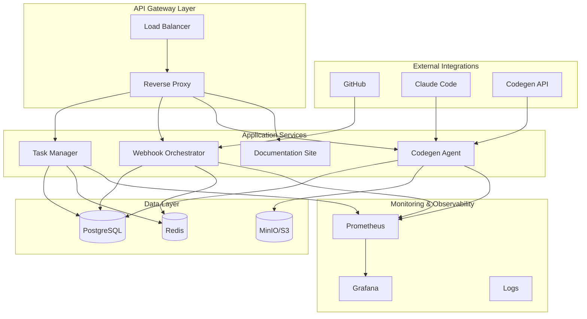
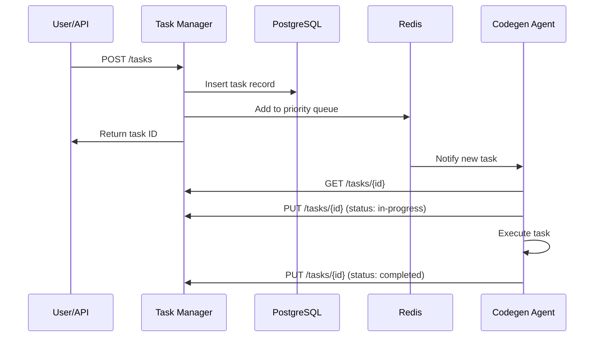
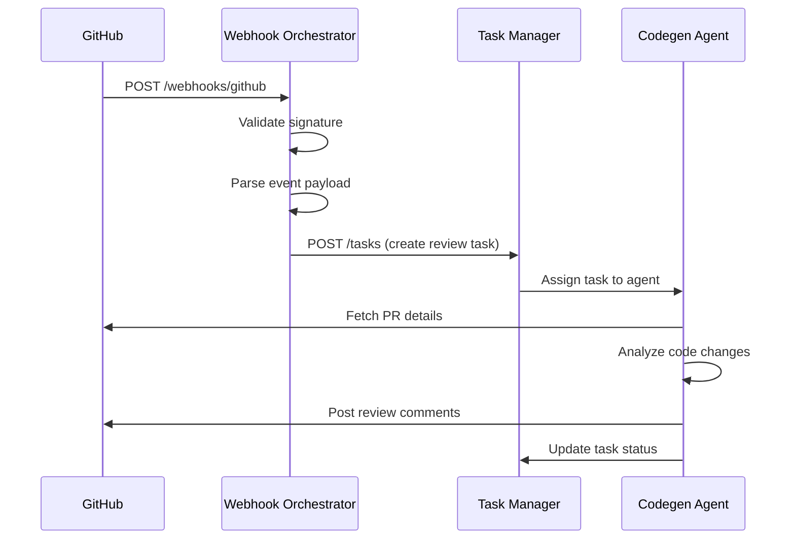

# System Architecture Overview

The Codegen AI Workflow Platform is a comprehensive, cloud-native system designed to orchestrate AI-powered development workflows with enterprise-grade reliability, scalability, and security.

## 🏗️ High-Level Architecture



## 🎯 Core Components

### 1. Task Manager Service
**Purpose**: Central orchestration engine for AI workflow tasks

**Key Features**:
- Task lifecycle management (pending → in-progress → validation → complete)
- Priority-based task scheduling
- Dependency resolution and execution ordering
- Multi-agent coordination and load balancing
- Real-time status tracking and notifications

**Technology Stack**:
- **Framework**: FastAPI (Python)
- **Database**: PostgreSQL for persistent storage
- **Cache**: Redis for session management and quick lookups
- **Message Queue**: Redis Pub/Sub for real-time updates
- **API**: RESTful with OpenAPI 3.0 specification

### 2. Webhook Orchestrator Service
**Purpose**: Event-driven automation hub for external integrations

**Key Features**:
- GitHub webhook processing (PR events, push events, issues)
- Secure webhook validation and authentication
- Event routing and transformation
- Retry logic with exponential backoff
- Integration with multiple external services

**Technology Stack**:
- **Framework**: FastAPI (Python)
- **Security**: HMAC signature validation
- **Processing**: Async event handling
- **Storage**: PostgreSQL for event logs and audit trails

### 3. Codegen Agent Service
**Purpose**: AI-powered code generation and analysis engine

**Key Features**:
- Integration with Codegen SDK and Claude Code
- Context-aware code generation
- Automated code review and validation
- Multi-language support (Python, JavaScript, TypeScript, etc.)
- Intelligent error detection and fixing

**Technology Stack**:
- **AI Integration**: Codegen SDK, Claude API
- **Code Analysis**: AST parsing, static analysis tools
- **Version Control**: Git integration for branch management
- **Storage**: MinIO/S3 for code artifacts and logs

### 4. Documentation Website
**Purpose**: Interactive documentation and API exploration platform

**Key Features**:
- Live API testing with Swagger UI integration
- Comprehensive tutorials and guides
- Advanced search with full-text indexing
- Responsive design for all devices
- Real-time documentation updates

**Technology Stack**:
- **Frontend**: Next.js 14 with React 18
- **Styling**: Tailwind CSS with custom components
- **Search**: Fuse.js for client-side search
- **API Testing**: Swagger UI React integration

## 🗄️ Data Architecture

### PostgreSQL Database Schema

```sql
-- Core task management
CREATE TABLE tasks (
    id UUID PRIMARY KEY DEFAULT gen_random_uuid(),
    title VARCHAR(255) NOT NULL,
    description TEXT,
    status task_status_enum NOT NULL DEFAULT 'pending',
    priority INTEGER CHECK (priority BETWEEN 1 AND 5) DEFAULT 3,
    assignee VARCHAR(255),
    metadata JSONB,
    dependencies UUID[],
    created_at TIMESTAMP WITH TIME ZONE DEFAULT NOW(),
    updated_at TIMESTAMP WITH TIME ZONE DEFAULT NOW(),
    completed_at TIMESTAMP WITH TIME ZONE
);

-- Workflow definitions
CREATE TABLE workflows (
    id UUID PRIMARY KEY DEFAULT gen_random_uuid(),
    name VARCHAR(255) NOT NULL,
    description TEXT,
    template VARCHAR(100) NOT NULL,
    configuration JSONB,
    created_at TIMESTAMP WITH TIME ZONE DEFAULT NOW()
);

-- Agent management
CREATE TABLE agents (
    id VARCHAR(255) PRIMARY KEY,
    name VARCHAR(255) NOT NULL,
    type agent_type_enum NOT NULL,
    capabilities TEXT[],
    status agent_status_enum DEFAULT 'active',
    configuration JSONB,
    last_seen TIMESTAMP WITH TIME ZONE DEFAULT NOW()
);

-- Event logging
CREATE TABLE events (
    id UUID PRIMARY KEY DEFAULT gen_random_uuid(),
    event_type VARCHAR(100) NOT NULL,
    source VARCHAR(100) NOT NULL,
    payload JSONB,
    processed_at TIMESTAMP WITH TIME ZONE,
    created_at TIMESTAMP WITH TIME ZONE DEFAULT NOW()
);
```

### Redis Data Structures

```redis
# Task queues (priority-based)
ZADD task_queue:high 1640995200 "task:uuid1"
ZADD task_queue:medium 1640995200 "task:uuid2"
ZADD task_queue:low 1640995200 "task:uuid3"

# Agent status tracking
HSET agent:status "codegen-agent-1" "busy"
HSET agent:status "codegen-agent-2" "idle"

# Session management
SET session:user123 "jwt_token_here" EX 3600

# Real-time notifications
PUBLISH task_updates '{"task_id": "uuid", "status": "completed"}'
```

## 🔄 Data Flow

### 1. Task Creation Flow


### 2. Webhook Processing Flow


## 🔐 Security Architecture

### Authentication & Authorization
- **JWT-based authentication** for API access
- **Role-based access control (RBAC)** for different user types
- **API key management** for service-to-service communication
- **OAuth 2.0 integration** for GitHub and other external services

### Data Protection
- **Encryption at rest** using AES-256 for sensitive data
- **TLS 1.3 encryption** for all network communication
- **Secrets management** using environment variables and secure vaults
- **Input validation** and sanitization for all API endpoints

### Network Security
- **VPC isolation** in cloud deployments
- **Firewall rules** restricting access to necessary ports only
- **Rate limiting** to prevent abuse and DDoS attacks
- **CORS configuration** for web application security

## 📊 Monitoring & Observability

### Metrics Collection
```yaml
# Prometheus metrics configuration
global:
  scrape_interval: 15s
  evaluation_interval: 15s

scrape_configs:
  - job_name: 'task-manager'
    static_configs:
      - targets: ['task-manager:8001']
    metrics_path: '/metrics'
    
  - job_name: 'webhook-orchestrator'
    static_configs:
      - targets: ['webhook-orchestrator:8002']
    
  - job_name: 'codegen-agent'
    static_configs:
      - targets: ['codegen-agent:8003']
```

### Key Performance Indicators (KPIs)
- **Task Completion Rate**: Percentage of tasks completed successfully
- **Average Response Time**: API endpoint response times
- **Error Rate**: Percentage of failed requests
- **Agent Utilization**: Percentage of time agents are actively working
- **System Resource Usage**: CPU, memory, and disk utilization

### Alerting Rules
```yaml
groups:
  - name: codegen_platform
    rules:
      - alert: HighErrorRate
        expr: rate(http_requests_total{status=~"5.."}[5m]) > 0.1
        for: 5m
        labels:
          severity: critical
        annotations:
          summary: "High error rate detected"
          
      - alert: TaskQueueBacklog
        expr: redis_list_length{key="task_queue"} > 100
        for: 10m
        labels:
          severity: warning
        annotations:
          summary: "Task queue backlog detected"
```

## 🚀 Scalability Design

### Horizontal Scaling
- **Stateless services** enable easy horizontal scaling
- **Load balancing** distributes traffic across multiple instances
- **Database connection pooling** optimizes resource usage
- **Microservices architecture** allows independent scaling of components

### Performance Optimization
- **Redis caching** for frequently accessed data
- **Database indexing** for optimal query performance
- **Async processing** for non-blocking operations
- **CDN integration** for static asset delivery

### Auto-scaling Configuration
```yaml
# Kubernetes HPA example
apiVersion: autoscaling/v2
kind: HorizontalPodAutoscaler
metadata:
  name: task-manager-hpa
spec:
  scaleTargetRef:
    apiVersion: apps/v1
    kind: Deployment
    name: task-manager
  minReplicas: 2
  maxReplicas: 10
  metrics:
  - type: Resource
    resource:
      name: cpu
      target:
        type: Utilization
        averageUtilization: 70
```

## 🔄 Deployment Architecture

### Multi-Environment Support
- **Development**: Local Docker Compose setup
- **Staging**: Cloud-based with reduced resources
- **Production**: Full cloud deployment with HA and DR

### Infrastructure as Code
```hcl
# Terraform example for AWS
resource "aws_ecs_cluster" "codegen_cluster" {
  name = "codegen-platform"
  
  setting {
    name  = "containerInsights"
    value = "enabled"
  }
}

resource "aws_ecs_service" "task_manager" {
  name            = "task-manager"
  cluster         = aws_ecs_cluster.codegen_cluster.id
  task_definition = aws_ecs_task_definition.task_manager.arn
  desired_count   = 2
  
  load_balancer {
    target_group_arn = aws_lb_target_group.task_manager.arn
    container_name   = "task-manager"
    container_port   = 8001
  }
}
```

## 🔧 Configuration Management

### Environment-Specific Configuration
```yaml
# config/environments/production.yaml
database:
  host: ${DATABASE_HOST}
  port: 5432
  name: ${DATABASE_NAME}
  pool_size: 20
  
redis:
  host: ${REDIS_HOST}
  port: 6379
  max_connections: 100
  
logging:
  level: INFO
  format: json
  
security:
  jwt_secret: ${JWT_SECRET}
  token_expiry: 3600
```

### Feature Flags
```python
# Feature flag configuration
FEATURE_FLAGS = {
    "advanced_code_analysis": True,
    "multi_language_support": True,
    "experimental_ai_features": False,
    "enhanced_monitoring": True
}
```

## 📈 Future Architecture Considerations

### Planned Enhancements
1. **Event Sourcing**: Implement event sourcing for better audit trails
2. **CQRS Pattern**: Separate read and write models for better performance
3. **GraphQL API**: Add GraphQL endpoint for flexible data querying
4. **Machine Learning Pipeline**: Integrate ML models for predictive analytics
5. **Multi-Region Deployment**: Support for global deployment with data replication

### Technology Roadmap
- **Service Mesh**: Istio for advanced traffic management
- **Serverless Functions**: AWS Lambda/Azure Functions for event processing
- **Stream Processing**: Apache Kafka for real-time data streaming
- **Container Orchestration**: Advanced Kubernetes features and operators

---

This architecture provides a solid foundation for building scalable, reliable, and maintainable AI workflow automation systems while maintaining flexibility for future enhancements and integrations.

